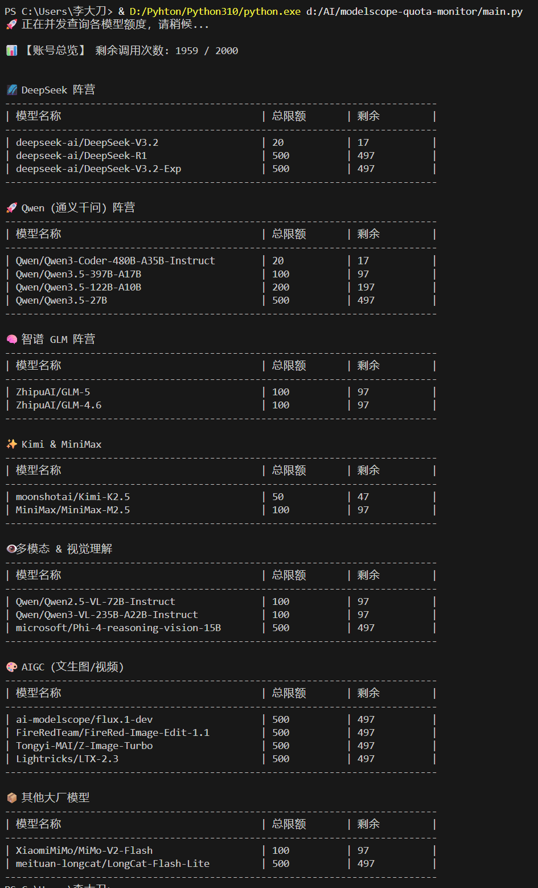

# 📊 ModelScope API Quota Monitor

一个轻量、优雅的终端命令行工具，用于批量监控和查询**魔搭社区 (ModelScope) API-Inference** 各大开源模型的实时调用额度。

> ✨ **特别说明**：此脚本核心代码与架构设计作者为 **Gemini 3.1 Pro**。

## 📺 效果展示



## 🎯 核心特性

- **🚀 多线程并发扫描：** 几秒内即可完成 20+ 个主流模型（DeepSeek, Qwen, GLM 等）的额度拉取，拒绝漫长等待。
- **🛡️ 纯粹的终端美学：** 针对中文字符宽度进行专门的底层计算，输出完美对齐的 Markdown 风格表格；支持视觉化警示符号（🔴 429 限流提示，⚠️ 报错提示）。
- **🧠 智能能力排序：** 数据自动按“大厂阵营”分组，组内按“限额/能力”智能排序，让你一眼挑出当前最强可用模型。
- **🔒 环境绝对隔离：** 采用 `.env` 配置文件加载 Token，从根本上防止凭证意外泄露到公开的代码仓库。
- **💾 零成本离线缓存：** 支持将全量扫描结果存入本地 JSON，随时随地 0 消耗查看大盘快照。

## 🗂️ 项目结构

```text
modelscope-api-monitor/
├── .env.example          # Token 配置模板（开源展示用）
├── .gitignore            # Git 忽略配置（保护真实 Token 和缓存）
├── requirements.txt      # Python 依赖清单
├── main.py               # 核心监控脚本
└── README.md             # 项目说明文档
```

## 📦 快速开始

### 1. 克隆项目

``` Bash
git clone https://github.com/483218131/modelscope-quota-monitor.git
cd modelscope-quota-monitor
```

### 2. 安装依赖

本项目极度轻量，仅依赖两个基础库。建议在虚拟环境中运行：

``` Bash
pip install -r requirements.txt
```

### 3. 配置 Token (必填)

复制环境变量模板文件：

``` Bash
cp .env.example .env
```

打开刚刚生成的 `.env` 文件，填入你的魔搭 SDK Token（可在魔搭社区个人中心 -> 访问令牌 获取）：

``` Code snippet
MODELSCOPE_API_TOKEN=你的真实Token写在这里
```

### 4. 运行工具

``` Bash
python main.py
```

运行后，根据终端弹出的交互式菜单输入数字即可体验不同的查询模式。

## ⚠️ 免责声明

本项目通过解析魔搭 API 网关返回的 `Headers` 来提取额度信息。由于官方未提供独立的计费查询接口，若官方未来调整网关限流策略（例如在报错时不返回配额 Headers），本工具的部分低消耗探测功能可能会受到影响。
